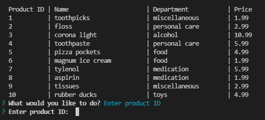

# bamazon

# Homework Description

# Customer View

This program contacts product inventory database and displays the results as shown below including unique product id, product name, department, and product price. Afterwards the user is prompted to either quit, enter product id, or display inventory.

If the user chooses quit option, the program terminates as shown below.

If the user chooses display inventory, inventory is displayed again as shown in the first image, and user is asked the same question.

If the user chooses enter product id option, user is prompted for a unique product id to be entered as shown below.

If the user enters valid product id, the user is then asked to enter product quantity as shown below.

Afterwards, total product cost is displayed database is updated, and user is again asked to either choose quit, enter product id, or display inventory as shown below.

Input validation is used everywhere.

# Manager View

In this part of homework, user has options to quit, view low inventory, view products for sale, add to inventory, and add new product.

# Homework Creation Process

The program was created in javascript using node.js, mysql and inquirer packages. Database was set up in MySQL Workbench.

